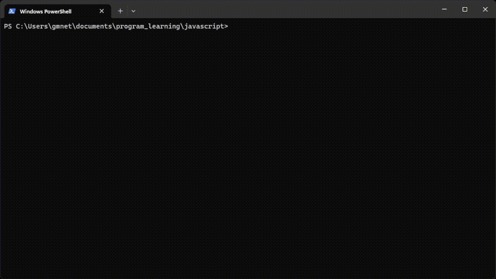

# Conceito de Jogo de Caça-níquel
> Jogo de caça-níquel interativo feito em JavaScript.

Trata-se de um jogo simples de caça-níquel. O jogo se dá de forma interativa, iniciando com um "depósito" do usuário, onde o valor é validado e convertido para o tipo adquado.
Em seguida, o usuário especifica o valor que deseja apostar, além das  linhas de probabilidade da sua aposta. 
O jogo então gera de forma aleatória colunas e linhas com símbolos, neste protótipo, representados por: A, B, C e D.
 O resultado da aposta é exibido ao final, com amostra do valor ganho, bem como com o saldo ajustado após o jogo.
 O jogo executa em loop até o saldo acabar ou indicação do usuário.



## Usos da Aplicação

A ideia por trás da elaboração desse projeto é a implementação em página web que serviria como meio de atração, engajamento e interatividade entre streamers e suas respectivas audiência.
O valor apostado seria fictício e proveniente de pontos acumulados durante o tempo assistido do usuário em relação à live.
Os premios também podem variar de acordo com o interesse de cada streamer.

## Lógica Implementada

Inicialmente, é solicitado um input ao usuário, onde ele indica qual valor deseja colocar em jogo:

```sh
const deposito = () => {
    while(true) { 
        const valorDeposito = prompt("Insira o valor do depósito: ");
        const valorDepositoToNumber = parseFloat(valorDeposito);

        if(isNaN(valorDepositoToNumber) || valorDepositoToNumber <= 0) {
            console.log("Valor inválido, tente novamente.");
        } else {
            return valorDepositoToNumber;
        }
    }
};
```
Após a indicação do valor colocado em jogo, é solicitado ao usuário informar em quantas linhas horizontais deseja concorrer, que diz respeito à linha onde é necessário existir uma sequencia de síbolos iguais que irá importar na vitória daquela jogada:

```sh
const linhasAposta = () => {
    while(true) { 
        const linhas = prompt("Insira o numero de linhas da sua aposta (1-3): ");
        const numeroLinhas = parseFloat(linhas);

        if(isNaN(numeroLinhas) || numeroLinhas <= 0 || numeroLinhas > 3) {
            console.log("Valor inválido de aposta, tente novamente.");
        } else {
            return numeroLinhas;
        }
    }
}
```
Uma vez informadas as linhas onde o jogador concorrerá, é solicitado o valor por aposta, que será levado em consideração após o resultado do jogo:
```sh
const getAposta = (saldo, linhas) => {
    while(true) { 
        const bet = prompt("Insira o valor da sua aposta, baseado nas linhas escolhidas: ");
        const numeroBet = parseFloat(bet);

        if(isNaN(numeroBet) || numeroBet <= 0 || numeroBet > saldo / linhas) {
            console.log("Valor de aposta inválido.");
        } else {
            return numeroBet;
        }
    }    
}
```
Após finalizada a fase inicial de aposta, a lógica do jogo é implementada, com a definição da quantidade de símbolos existentes em cada roda do slot, qual valor correspondente de cada um dos símbolos, sendo que os símbolos mais escaços importam em um multiplicador de vitória mairo em relação aos símbolos mais populosos.
Tais valores são armazenados em constantes no início do código.

A lógica implementada para efetivação de cada giro do caça-níquel é simples, inicialmente a totalidade dos símbolos possíveis é inserida em um array e, em seguida, é feita uma seleção aleatória das 3 peças exibidas em cada uma das trÊs rodas, tomando-se o cuidado de remover do array a entrada inicialmente selecionada para ser exibida.


```sh
const rolada = () => {
    const simbolos = [];
    for (const [simbolo, contagem] of Object.entries(CONTAGEM_SIMBOLOS)) {
        for(let i = 0; i < contagem; i++) {
            simbolos.push(simbolo);
        }
    }
    
    const rodas = [];
    for (let i = 0;  i < COLUNAS; i++) {
        rodas.push([]);
        const simbolosRoda = [...simbolos];
        for (let j = 0; j < LINHAS; j++) {
            const indiceRandomico = Math.floor(Math.random() * simbolosRoda.length);
            const simbolosSelecionados = simbolosRoda[indiceRandomico];
            rodas[i].push(simbolosSelecionados)
            simbolosRoda.splice(indiceRandomico, 1);
        }
    }
    return rodas;
};
```
Para fins de maior legibilidade do usuário, por se tratar de um programa desenvolvido inicialmente em linha de comando, foi feita a transposição dos arrays para que sejam exibidos em forma de matriz

```sh
const transposicao = (rodas) => {
    const linhas = [];
    for (let i = 0; i < LINHAS; i++) {
        linhas.push([]);
        for (let j = 0; j < COLUNAS; j++){
            linhas[i].push(rodas[j][i])
        }
    }
    return linhas;
}

const printLinhas = (linhas) => {
    for (const linha of linhas) {
        let linhaString = "";
        for (const [i, simbolo] of linha.entries()){
            linhaString += simbolo
            if (i != linha.length - 1) {
                linhaString += " | "
            }
        }
        console.log(linhaString);
    }
};
```

Após passada a fase interativa, o jogo faz a validação do resultado, verificando se, nas linhas verticais apostadas pelo usuário, há uma sequência de 3 símbolos idênticos

```sh
const verificarVitoria = (linhas, bet, numeroLinhas) => {
    let ganhos = 0;

    for (let linha = 0; linha < numeroLinhas; linha++) {
        const simbolos = linhas[linha];
        let todosIguais = true;

        for (const simbolo of simbolos) {
            if (simbolo != simbolos[0]) {
                todosIguais = false;
                break;
            }
        }

        if (todosIguais) {
            ganhos += bet * VALOR_SIMBOLOS[simbolos[0]];
        }
    }

    return ganhos;
};
```
Foi implementando ainda a hipótese de o jogador, caso tenha ficado sem saldo para continuar jogando, realize o depósito de valor complementar, quando a condição, saldo <=0 for identificada

```sh
const solicitarDeposito = () => {
    let novoDeposito = 0;
    while (true) {
        console.log("Seu saldo acabou ou é insuficiente. Você precisa fazer um novo depósito.");
        const valorDeposito = deposito();

        if (valorDeposito > 0) {
            novoDeposito = valorDeposito;
            break;
        } else {
            console.log("O valor do depósito precisa ser maior que zero.");
        }
    }
    return novoDeposito;
};
```
Por fim, toda a lógica do jogo é contida dentro da função jogo que, baseada nos retornos das demais funções existentes no código, faz o tratamento das jogadas, vitórias, derrotas e gerenciamento do saldo do usuário:

```sh
const jogo = () => {
    let saldo = deposito();

    while (true) {
        console.log("Você possui o saldo de R$ " + saldo);

        const numeroLinhas = linhasAposta();
        const bet = getAposta(saldo, numeroLinhas);
        
        if (bet * numeroLinhas > saldo) {
            saldo = solicitarDeposito();
            continue; 
        }

        saldo -= bet * numeroLinhas;

        const rodas = rolada();
        const linhas = transposicao(rodas);
        printLinhas(linhas);

        const ganhos = verificarVitoria(linhas, bet, numeroLinhas);
        saldo += ganhos;

        console.log("Você ganhou, R$" + ganhos.toString());

        if (saldo <= 0) {
            console.log("Você não tem saldo suficiente!");
            saldo = solicitarDeposito(); 
        }

        const jogarNovamente = prompt("Você quer jogar novamente (y/n)? ");
        if (jogarNovamente.toLowerCase() !== "y") break;
    }
};
```
## Ambiente de Desenvolvimento

O jogo foi programado em VS Code, contudo, é necessário que seja instalado o pacote `prompt-sync` que possibilita coletar inputs do usuário.
Para fazer a instalação dessa dependência, basta seguir os passos:

```sh
npm init
npm i prompt-sync
```

## Meta
Guilherme Micelli Netto
Twitter: [@GuinasCode](https://twitter.com/GuinasCode)
Youtube: [@GuinasCode](https://youtube.com/@GuinasCode)
Email: gmnetto@gmail.com
GitHub: https://github.com/GuinasCode
